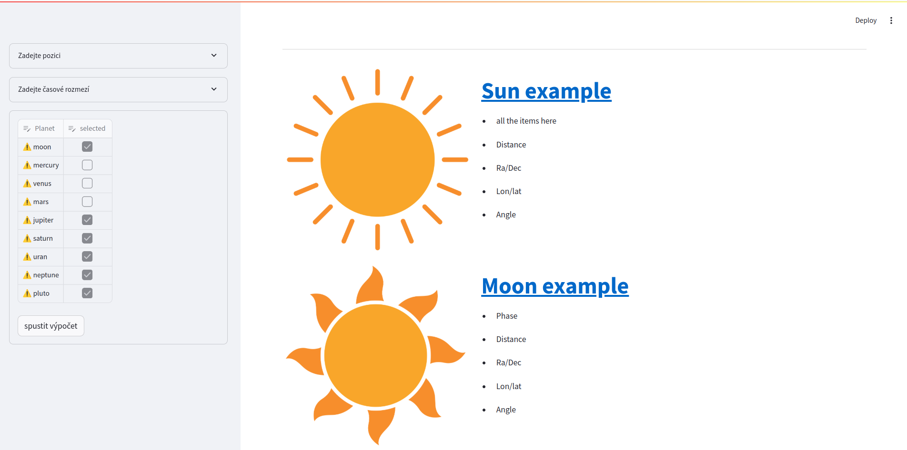

# PlanetarySystemObserver

Layout for observing planetary system object positions using various [sources](./sources.md) data.

The second part is about representation these positions as [[zodiac|zodiacal position]].

## Visualization libraries

- Skyfield
    - [Positions — Skyfield documentation](https://rhodesmill.org/skyfield/positions.html)

## Visualization styles

- [3D Solar System Viewer | TheSkyLive.com](https://theskylive.com/3dsolarsystem)
- [Real-Time, Real Data | NASA Solar System Exploration](https://solarsystem.nasa.gov/resources/2515/real-time-real-data/)
- [Solar System Scope - Online Model of Solar System and Night Sky](https://www.solarsystemscope.com/)

## Screenshot



## How to use

- ensure you have [python3](https://www.python.org/downloads/) installed
- clone the workspace
- work in a virtual environment

```shell
python -m venv planetary  # init directory
source planetary/bin/activate  # activate environment
pip-compile --upgrade --strip-extras requirements.in # regenerate dependencies
pip install -r requirements.txt  # install dependencies
```

- run the code

```shell
# basic run (command line experience)
python observer
# alternatives
jupyter notebook  # duplicated code with description
streamlit run observer/ui_streamlit.py  # web application
python -m streamlit run observer/ui_streamlit.py
```
